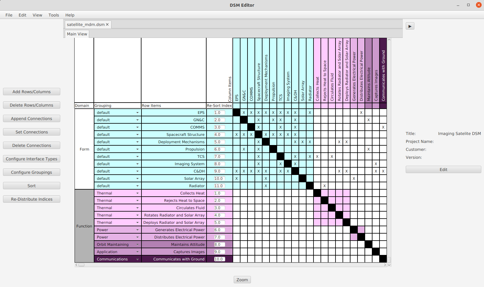

# DSMEditor
An open-source application for editing, designing, and analyzing Design Structure Matrices
### Dependencies
[jdom 2.0.6 - XML Parser](http://www.jdom.org/downloads/)

[apache poi 5.0.0 - Excel Parser](https://poi.apache.org/download.html#POI-5.0.0)

[javafx 11.0.2 - Graphics Library](https://gluonhq.com/products/javafx/) (Note: this is needed as a runtime dependency as well as compile time)

### To Install
Download the latest .jar file and run the installer

or
* Download the latest .jar file from the releases page
* Download the javafx Library
* Make sure java 16.0.1 is installed and is on the path

### To Run
If you used the installer, you can run the program with the created batch file <code>DSMEditor.bat</code>

To run from the command prompt use
<code>java -jar --module-path "path_to_javafx_sdk\javafx-sdk-11.0.2\lib" --add-modules=javafx.controls (name_of_jar_file)</code>

### Sample Usage

  
  Editing DSM Connections

  
  Sample Symmetric DSM of a Clock

### Feedback?
If you encounter any bugs or would like to submit a feature request, feel free to raise an issue, and I will work on it as soon as possible.

### License
[MIT](https://opensource.org/licenses/MIT)

### Project Status
This project is in active development with commits every few days
##### What's Next?
* Propagation analysis
* More highlighting features
* Export to <code>.png</code> and <code>.xlsx</code>
* Portability testing
