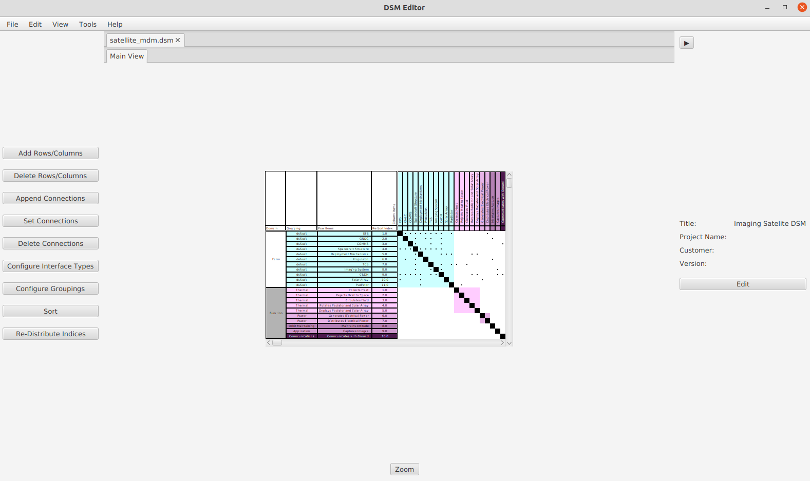
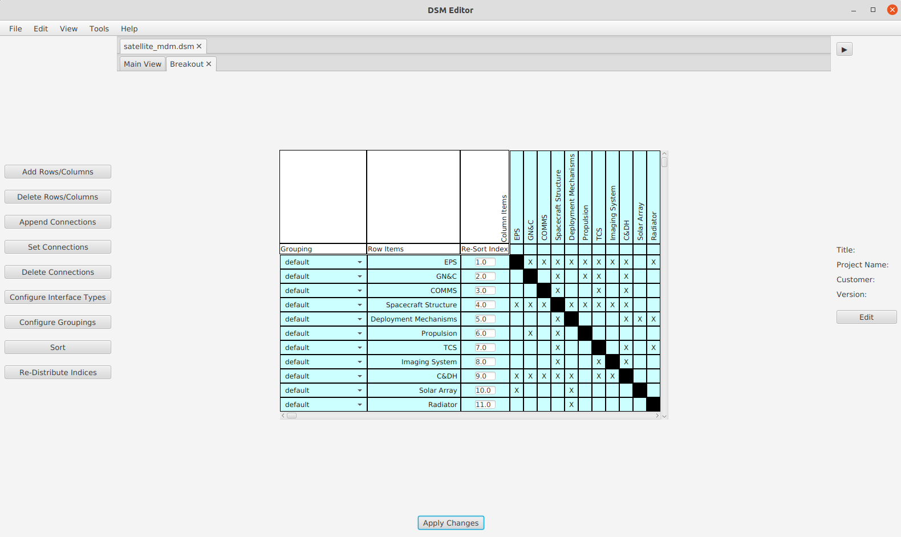

# DSMEditor
Design Structure Matrix editor (DSM editor) - An open-source application for editing, designing, and analyzing Design Structure Matrices

---

### Features
* Multiple DSM types: Multi-Domain, Symmetric, and Asymmetric
* Functionality to easily configure elements and their order, domains, groupings, and connections
* Interface Types for connections
* Opening breakout views for Multi-Domain DSMs to edit a smaller matrix 
* Fast Render mode that removes a lot of graphical detail to load bigger matrices faster and see a bigger picture
* Propagation Analysis
* Export to various formats: CSV, Excel, PNG, Thebeau Matlab File 
* Clustering algorithm based on [Ronnie Thebeau's clustering algorithm](https://dsmweb.org/matlab-macro-for-clustering-dsms/). NOTE: this is a beta feature and has not been fully validated

### To Install for Developers (version >= 2.0.0)
Requirements:
* Maven
* IntelliJ (or another IDE)

Maven will install all the dependencies. There may be issues with the java runtime version not being installed correctly. If there are cryptic run-time issues, most likely the correct version (16.0.2) of java is not installed

### To Install for Users (version >= 2.0.0)
* Go to the [releases page](https://github.com/ajcarney/DSMEditor/releases) and download the latest zip or tar file for your operating system
* Unzip the file to a known directory with write permissions so that the program can save to files.
* No need to install anything else (including java) as the program comes pre-packaged with an open-source version of the Java runtime from [Adoptium](https://adoptium.net/) (no need to mess with Oracle anymore)
* The zip file includes an executable (.exe for windows or .sh for unix) that will start the program

### Getting Started
To create a new matrix, select the "File" drop-down menu and select "New...". Choose any of the types available

To modify row items, use the toolbar on the left-hand side of the screen

Connections can be created using either the toolbar or clicking directly on a cell. To make searching for connections easier, you can use the "F" key as a toggle for enabling cross highlighting of the cell you are hovering over.

---

### Sample Usage

    
    Sample Multi-Domain DSM

    
    Sample Multi-Domain DSM - Fast Render View Mode

    
    Symmetric Breakout View for a Multi-Domain DSM

    
    Editing DSM connections

    
    Propagation analysis for the sample matrix

---

### Feedback?
If you encounter any bugs or would like to submit a feature request, feel free to raise an issue, and I will work on it as soon as possible.

### License
[MIT](https://opensource.org/licenses/MIT)

### Project Status
This project is in semi-active development. As a college student, the school year is busy, and as such, the majority of development is done during the summer months
##### What's Next?
* Better Support for Interface Types
* UI Fixes and Improvements
* Performance improvements
