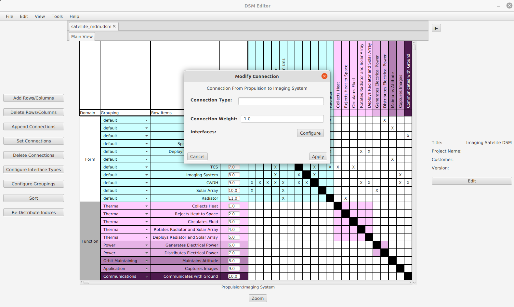

# DSMEditor
Design Structure Matrix editor (DSM editor) - An open-source application for editing, designing, and analyzing Design Structure Matrices

---

### Dependencies
[jdom 2.0.6 - XML Parser](http://www.jdom.org/downloads/)

[apache poi 5.0.0 - Excel Parser](https://poi.apache.org/download.html#POI-5.0.0)

[javafx 11.0.2 - Graphics Library](https://gluonhq.com/products/javafx/) (Note: this is needed as a runtime dependency as well as compile time)

---

### To Install
Download the latest .jar file and the installer. Run the installer and a batch script titled <code>DSMEditor.bat</code> will be created in the current directory and is used to run the program.

or
* Download the latest .jar file from the releases page
* Download the javafx Library
* Make sure java 16.0.1 is installed and is on the path

### To Run
If you used the installer, you can run the program with the created batch file <code>DSMEditor.bat</code>

To run from the command prompt use
<code>java -jar --module-path "(path_to_javafx_sdk)\javafx-sdk-11.0.2\lib" --add-modules=javafx.controls (name_of_jar_file)</code>

### Getting Started
To create a new matrix, select the "File" drop-down menu and select "New...". You can create either a symmetrical or non-symmetrical matrix.

To modify row items, use the toolbar on the left-hand side of the screen

Connections can be created using either the toolbar or clicking directly on a cell. To make searching for connections easier, you can use the "F" key as a toggle for enabling cross highlighting of the cell you are hovering over.

---

### Sample Usage

    
    Editing DSM connections

    
    Sample symmetric DSM of a clock

    
    Propagation analysis for the sample matrix

    
    

        Automatic clustering for the sample matrix based on 
        <a href="https://dsmweb.org/matlab-macro-for-clustering-dsms/">
          Ronnie Thebeau's clustering algorithm
        </a>
    

---

### Feedback?
If you encounter any bugs or would like to submit a feature request, feel free to raise an issue, and I will work on it as soon as possible.

### License
[MIT](https://opensource.org/licenses/MIT)

### Project Status
This project is in active development with commits every few days
##### What's Next?
* Propagation analysis with only specified connection names
* Keyboard bindings
